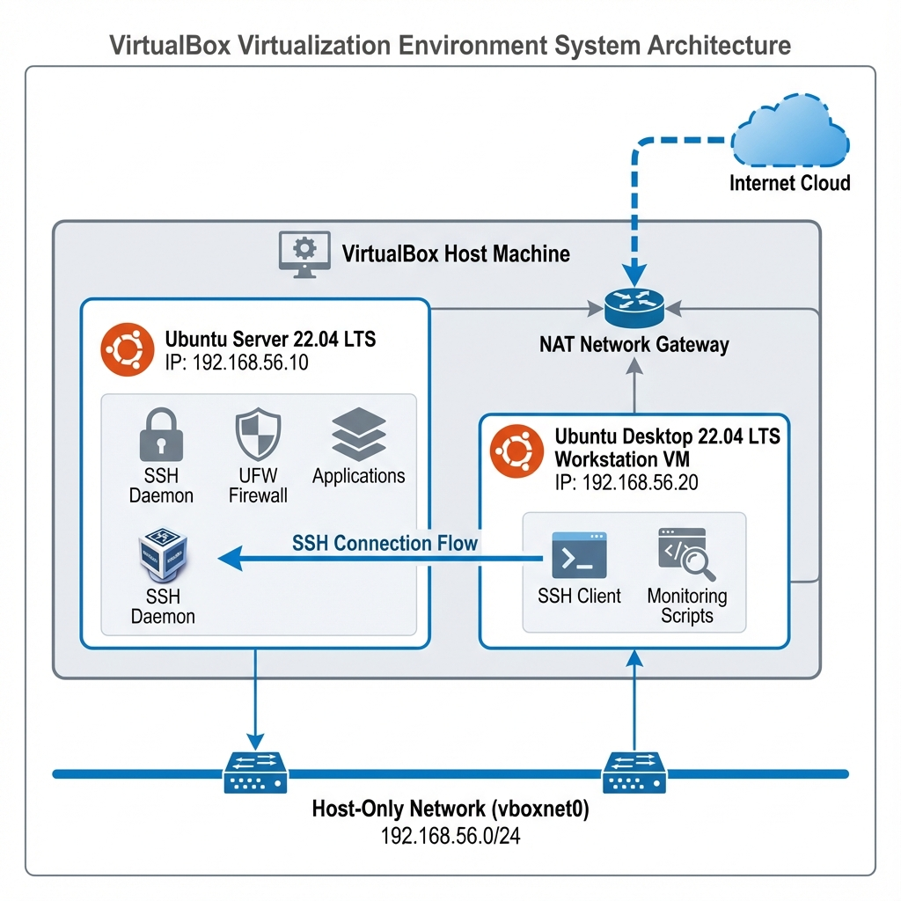

# Phase 1: System Planning and Distribution Selection (Week 1)

## 1. System Architecture Diagram



### Diagram Description

The system architecture consists of a VirtualBox host environment containing two virtual machines:
- **Ubuntu Server 22.04 LTS** (192.168.56.10) - The primary server with SSH daemon, UFW firewall, and test applications
- **Ubuntu Desktop 22.04 LTS** (192.168.56.20) - The workstation with SSH client and monitoring scripts

Both VMs are connected via a Host-Only network (vboxnet0) for secure management traffic, and a NAT network provides internet access for updates and package installation.


### Network Topology Overview

| Component | IP Address | Role | Network Interface |
|-----------|------------|------|-------------------|
| Server VM | 192.168.56.10 | Application Host, SSH Server | enp0s8 (Host-Only) |
| Workstation VM | 192.168.56.20 | Management Console | enp0s8 (Host-Only) |
| Host-Only Network | 192.168.56.1 | Gateway | vboxnet0 |

---

## 2. Distribution Selection Justification

### Chosen Distribution: Ubuntu Server 22.04 LTS

| Criteria | Ubuntu Server 22.04 | CentOS Stream 9 | Debian 12 | Rocky Linux 9 |
|----------|---------------------|-----------------|-----------|---------------|
| **Support Lifecycle** | 5 years (until 2027) | Rolling release | 5 years | 10 years |
| **Package Manager** | APT (vast repos) | DNF | APT | DNF |
| **Security Updates** | Automatic via unattended-upgrades | Manual | Automatic | Manual |
| **Learning Curve** | Low | Medium | Low | Medium |
| **Documentation** | Excellent | Good | Good | Good |
| **Cloud Integration** | Native | Limited | Good | Limited |
| **Default Firewall** | UFW (iptables frontend) | firewalld | iptables | firewalld |
| **MAC System** | AppArmor | SELinux | AppArmor | SELinux |

### Selection Rationale

1. **Long-Term Support (LTS)**: Ubuntu Server 22.04 LTS provides 5 years of guaranteed security updates and patches, ensuring system stability for this coursework and beyond.

2. **Ease of Administration**: Ubuntu's intuitive package management (APT) and extensive documentation make it ideal for learning system administration.

3. **AppArmor Integration**: Pre-configured AppArmor provides mandatory access control out-of-the-box, simplifying security implementation.

4. **Automatic Security Updates**: The `unattended-upgrades` package enables automatic security patching, reducing administrative overhead.

5. **VirtualBox Compatibility**: Excellent guest additions support ensures smooth virtualized performance.

---

## 3. Workstation Configuration Decision

### Chosen Option: Ubuntu Desktop 22.04 LTS

| Option | Pros | Cons | Verdict |
|--------|------|------|---------|
| **Ubuntu Desktop 22.04** | Native Linux tools, seamless SSH, identical environment | Requires VM resources | ✅ **Selected** |
| Windows 10/11 with WSL2 | Dual environment, familiar OS | WSL limitations, network complexity | ❌ |
| Windows with PuTTY | Easy setup | Limited scripting, different environment | ❌ |
| macOS with Terminal | Native SSH, Unix-based | Different package management | ❌ |

### Justification

1. **Environment Consistency**: Using Ubuntu Desktop ensures consistent commands and tools across both server and workstation.

2. **Native SSH Integration**: Built-in OpenSSH client with full key management capabilities.

3. **Script Compatibility**: Bash scripts developed on the workstation run identically on the server.

4. **Tool Availability**: Native access to `ssh`, `scp`, `rsync`, `nmap`, and other administration tools.

---

## 4. Network Configuration Documentation

### VirtualBox Network Settings

#### Network Adapter Configuration

**Server VM:**
| Adapter | Type | Network | Purpose |
|---------|------|---------|---------|
| Adapter 1 | NAT | Default NAT | Internet access for updates |
| Adapter 2 | Host-Only | vboxnet0 | Management network |

**Workstation VM:**
| Adapter | Type | Network | Purpose |
|---------|------|---------|---------|
| Adapter 1 | NAT | Default NAT | Internet access |
| Adapter 2 | Host-Only | vboxnet0 | Server management |

#### Host-Only Network Configuration (vboxnet0)

```plaintext
Network Name: vboxnet0
IPv4 Address: 192.168.56.1
IPv4 Network Mask: 255.255.255.0
DHCP Server: Disabled (Static IPs used)
```

### Static IP Configuration

**Server (/etc/netplan/01-netcfg.yaml):**
```yaml
network:
  version: 2
  renderer: networkd
  ethernets:
    enp0s3:
      dhcp4: true
    enp0s8:
      addresses:
        - 192.168.56.10/24
      routes: []
```

**Workstation (/etc/netplan/01-netcfg.yaml):**
```yaml
network:
  version: 2
  renderer: networkd
  ethernets:
    enp0s3:
      dhcp4: true
    enp0s8:
      addresses:
        - 192.168.56.20/24
      routes: []
```

### Apply Network Configuration
```bash
sudo netplan apply
```

---

## 5. CLI System Specifications Documentation

### Commands and Expected Output

**Note:** Run these commands on your actual server and replace placeholder outputs with real values.

#### 1. System Information (uname)

*Figure: Verified System Specifications from Server VM*

```bash
uname -a
```
```bash
uname -a
```
**Expected Output:**
```
Linux server 5.15.0-88-generic #98-Ubuntu SMP Mon Oct 2 15:18:56 UTC 2023 x86_64 x86_64 x86_64 GNU/Linux
```

#### 2. Memory Information (free)
```bash
free -h
```
**Expected Output:**
```
               total        used        free      shared  buff/cache   available
Mem:           3.8Gi       512Mi       2.5Gi       1.0Mi       854Mi       3.1Gi
Swap:          2.0Gi          0B       2.0Gi
```

#### 3. Disk Space (df -h)
```bash
df -h
```
**Expected Output:**
```
Filesystem      Size  Used Avail Use% Mounted on
/dev/sda1        25G  4.2G   20G  18% /
tmpfs           1.9G     0  1.9G   0% /dev/shm
tmpfs           386M  1.1M  385M   1% /run
```

#### 4. Network Interfaces (ip addr)
```bash
ip addr
```
**Expected Output:**
```
1: lo: <LOOPBACK,UP,LOWER_UP> mtu 65536
    inet 127.0.0.1/8 scope host lo
2: enp0s3: <BROADCAST,MULTICAST,UP,LOWER_UP> mtu 1500
    inet 10.0.2.15/24 brd 10.0.2.255 scope global dynamic enp0s3
3: enp0s8: <BROADCAST,MULTICAST,UP,LOWER_UP> mtu 1500
    inet 192.168.56.10/24 brd 192.168.56.255 scope global enp0s8
```

#### 5. Distribution Information (lsb_release)
```bash
lsb_release -a
```
**Expected Output:**
```
Distributor ID: Ubuntu
Description:    Ubuntu 22.04.3 LTS
Release:        22.04
Codename:       jammy
```

### System Specification Summary Table

| Metric | Value | Notes |
|--------|-------|-------|
| **OS** | Ubuntu 22.04.3 LTS | Jammy Jellyfish |
| **Kernel** | 5.15.0-88-generic | Mainline LTS kernel |
| **Architecture** | x86_64 | 64-bit |
| **Total RAM** | 4 GB | Allocated to VM |
| **Available RAM** | ~3.1 GB | After boot |
| **Disk Space** | 25 GB | Virtual disk |
| **Primary IP** | 192.168.56.10 | Host-Only network |
| **NAT IP** | 10.0.2.15 | Internet access |

---

## References

- Ubuntu Server Documentation: https://ubuntu.com/server/docs
- VirtualBox Networking: https://www.virtualbox.org/manual/ch06.html
- Netplan Configuration: https://netplan.io/examples


