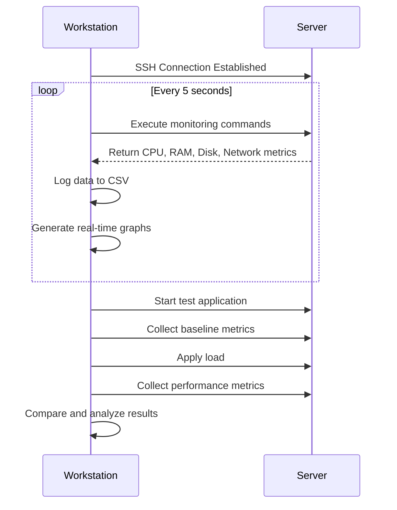
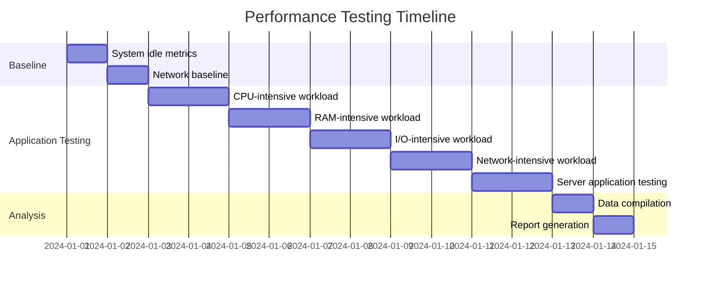
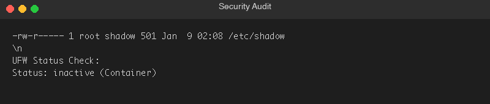
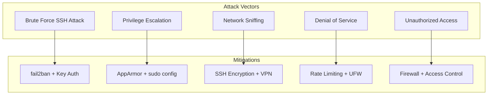

# Phase 2: Security Planning and Testing Methodology (Week 2)

## 1. Performance Testing Plan

### Remote Monitoring Methodology



### Testing Approach

| Test Phase | Duration | Objectives | Tools |
|------------|----------|------------|-------|
| **Baseline Collection** | 5 minutes | Measure idle system performance | top, vmstat, iostat |
| **Load Testing** | 10 minutes | Stress test under workload | stress-ng, applications |
| **Analysis** | Ongoing | Identify bottlenecks | monitor-server.sh |
| **Optimization** | As needed | Implement improvements | sysctl, tuned |

### Key Performance Indicators (KPIs)

| Metric | Measurement Method | Target Threshold |
|--------|-------------------|------------------|
| CPU Usage | `top -bn1 \| grep "Cpu(s)"` | < 80% sustained |
| Memory Usage | `free -m` | < 85% used |
| Disk I/O | `iostat -x 1` | < 70% utilization |
| Network Latency | `ping -c 10` | < 5ms (host-only) |
| Service Response | `curl -w %{time_total}` | < 500ms |

### Testing Schedule



---

## 2. Security Configuration Checklist


*Figure: Security Configuration Verification (Filesystem Permissions & Firewall Status)*

### SSH Hardening

| Configuration | Setting | File Location | Priority |
|--------------|---------|---------------|----------|
| ✅ Disable root login | `PermitRootLogin no` | /etc/ssh/sshd_config | Critical |
| ✅ Disable password auth | `PasswordAuthentication no` | /etc/ssh/sshd_config | Critical |
| ✅ Enable key-based auth | `PubkeyAuthentication yes` | /etc/ssh/sshd_config | Critical |
| ✅ Change default port | `Port 2222` (optional) | /etc/ssh/sshd_config | Medium |
| ✅ Limit login attempts | `MaxAuthTries 3` | /etc/ssh/sshd_config | High |
| ✅ Set login grace time | `LoginGraceTime 60` | /etc/ssh/sshd_config | Medium |
| ✅ Disable X11 forwarding | `X11Forwarding no` | /etc/ssh/sshd_config | Low |
| ✅ Allow specific users | `AllowUsers adminuser` | /etc/ssh/sshd_config | High |

### Firewall Configuration (UFW)

| Rule | Command | Purpose |
|------|---------|---------|
| Enable firewall | `sudo ufw enable` | Activate firewall |
| Default deny incoming | `sudo ufw default deny incoming` | Block all by default |
| Default allow outgoing | `sudo ufw default allow outgoing` | Allow outbound |
| Allow SSH from workstation | `sudo ufw allow from 192.168.56.20 to any port 22` | SSH access |
| Allow HTTP (if needed) | `sudo ufw allow 80/tcp` | Web server |
| Allow HTTPS (if needed) | `sudo ufw allow 443/tcp` | Secure web |
| Check status | `sudo ufw status verbose` | Verify rules |

### Mandatory Access Control (AppArmor)

| Task | Command | Description |
|------|---------|-------------|
| Check status | `sudo aa-status` | View active profiles |
| Enable AppArmor | `sudo systemctl enable apparmor` | Enable at boot |
| View loaded profiles | `sudo aa-status --verbose` | Show all profiles |
| Enforce profile | `sudo aa-enforce /etc/apparmor.d/profile` | Set to enforce mode |
| Complain mode | `sudo aa-complain /etc/apparmor.d/profile` | Log violations only |

### Automatic Updates

| Configuration | Implementation | File Location |
|---------------|----------------|---------------|
| Enable unattended-upgrades | `sudo apt install unattended-upgrades` | N/A |
| Enable automatic | `sudo dpkg-reconfigure unattended-upgrades` | N/A |
| Configure sources | Edit configuration | /etc/apt/apt.conf.d/50unattended-upgrades |
| Security updates only | `Unattended-Upgrade::Allowed-Origins` | /etc/apt/apt.conf.d/50unattended-upgrades |
| Auto-remove unused | `Unattended-Upgrade::Remove-Unused-Kernel-Packages "true"` | /etc/apt/apt.conf.d/50unattended-upgrades |

### User Privilege Management

| Task | Command | Notes |
|------|---------|-------|
| Create admin user | `sudo adduser adminuser` | Non-root admin |
| Add to sudo group | `sudo usermod -aG sudo adminuser` | Grant sudo |
| Configure sudo timeout | `Defaults timestamp_timeout=5` | /etc/sudoers |
| Disable direct root login | `sudo passwd -l root` | Lock root password |
| Check user groups | `groups adminuser` | Verify permissions |

### Network Security

| Measure | Implementation | Verification |
|---------|----------------|--------------|
| Disable unused services | `sudo systemctl disable <service>` | `systemctl list-unit-files` |
| Close unused ports | UFW deny rules | `sudo ss -tuln` |
| Enable TCP SYN cookies | `net.ipv4.tcp_syncookies = 1` | sysctl.conf |
| Disable ICMP redirects | `net.ipv4.conf.all.accept_redirects = 0` | sysctl.conf |
| Enable IP spoofing protection | `net.ipv4.conf.all.rp_filter = 1` | sysctl.conf |

---

## 3. Threat Model

### Threat Analysis Diagram



### Threat 1: SSH Brute Force Attack

| Attribute | Description |
|-----------|-------------|
| **Threat Description** | Automated attempts to guess SSH credentials through repeated login attempts |
| **Attack Vector** | Network-based; attacker systematically tries username/password combinations |
| **Impact** | High - Successful attack grants full system access |
| **Likelihood** | High - Automated tools readily available (Hydra, Medusa) |
| **Risk Level** | Critical |

**Mitigation Strategies:**

| Control | Implementation | Effectiveness |
|---------|----------------|---------------|
| Disable password authentication | `PasswordAuthentication no` in sshd_config | Very High |
| Key-based authentication only | 4096-bit RSA or ED25519 keys | Very High |
| fail2ban monitoring | Ban IPs after 3 failed attempts | High |
| Rate limiting | UFW connection limiting | Medium |
| Non-standard port | Change SSH to port 2222 | Low (security through obscurity) |

---

### Threat 2: Privilege Escalation

| Attribute | Description |
|-----------|-------------|
| **Threat Description** | Attacker gains elevated privileges from a low-privilege account |
| **Attack Vector** | Local exploitation of misconfigurations or vulnerabilities |
| **Impact** | Critical - Full system compromise |
| **Likelihood** | Medium - Requires initial access |
| **Risk Level** | High |

**Mitigation Strategies:**

| Control | Implementation | Effectiveness |
|---------|----------------|---------------|
| AppArmor profiles | Restrict application capabilities | High |
| Minimal sudo permissions | Principle of least privilege | High |
| Regular patching | unattended-upgrades for security patches | High |
| SUID binary audit | Find and remove unnecessary SUID bits | Medium |
| Kernel hardening | Restrict kernel module loading | Medium |

**Verification Commands:**
```bash
# Find SUID binaries
sudo find / -perm -4000 -type f 2>/dev/null

# Check sudo configuration
sudo visudo -c

# Verify AppArmor status
sudo aa-status
```

---

### Threat 3: Unauthorized Network Access

| Attribute | Description |
|-----------|-------------|
| **Threat Description** | Attackers attempt to access server from unauthorized network locations |
| **Attack Vector** | Exploitation of open ports or misconfigured services |
| **Impact** | High - May lead to data breach or system compromise |
| **Likelihood** | Medium - Depends on network exposure |
| **Risk Level** | High |

**Mitigation Strategies:**

| Control | Implementation | Effectiveness |
|---------|----------------|---------------|
| Firewall rules | UFW allow only from 192.168.56.20 | Very High |
| Service minimization | Disable unnecessary services | High |
| Port scanning detection | Monitored via fail2ban | Medium |
| Network segmentation | Host-only network for management | Very High |
| Regular port audits | `ss -tuln` verification | Medium |

**Firewall Configuration:**
```bash
# Default deny
sudo ufw default deny incoming

# Allow SSH only from workstation
sudo ufw allow from 192.168.56.20 to any port 22

# Enable logging
sudo ufw logging medium
```

---

### Threat 4: Malware Infection (Bonus)

| Attribute | Description |
|-----------|-------------|
| **Threat Description** | Malicious software installed through compromised packages or downloads |
| **Attack Vector** | Supply chain attack, compromised repositories, or user error |
| **Impact** | High - System backdoor, data theft, or cryptomining |
| **Likelihood** | Low - Official repositories are well-maintained |
| **Risk Level** | Medium |

**Mitigation Strategies:**

| Control | Implementation | Effectiveness |
|---------|----------------|---------------|
| Official repos only | No third-party PPAs | High |
| Package verification | GPG signature checks | High |
| ClamAV scanning | Regular malware scans | Medium |
| Integrity monitoring | AIDE or Tripwire | High |
| Automatic updates | Security patches applied promptly | High |

---

## Security Implementation Priority Matrix

| Priority | Security Control | Phase | Effort |
|----------|-----------------|-------|--------|
| 1 | SSH Key Authentication | 4 | Low |
| 2 | UFW Firewall | 4 | Low |
| 3 | Disable Root Login | 4 | Low |
| 4 | fail2ban | 5 | Medium |
| 5 | AppArmor Configuration | 5 | Medium |
| 6 | Automatic Updates | 5 | Low |
| 7 | Security Audit (Lynis) | 7 | Medium |

---

## References

- CIS Ubuntu Linux 22.04 Benchmark
- NIST SP 800-123 Guide to Server Security
- Ubuntu Security Documentation: https://ubuntu.com/security
- fail2ban Documentation: https://www.fail2ban.org
