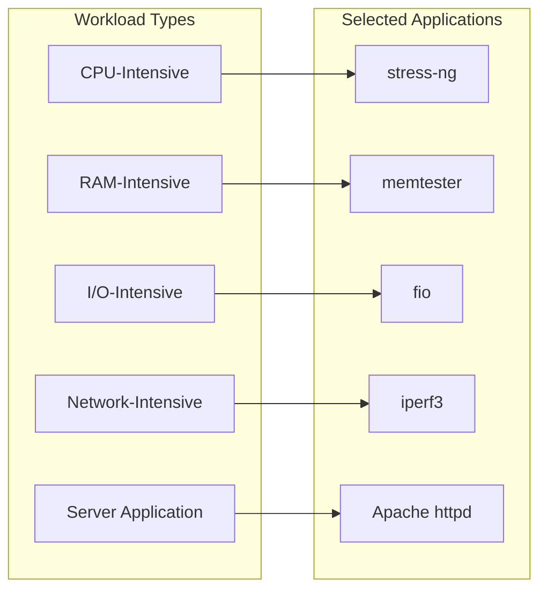
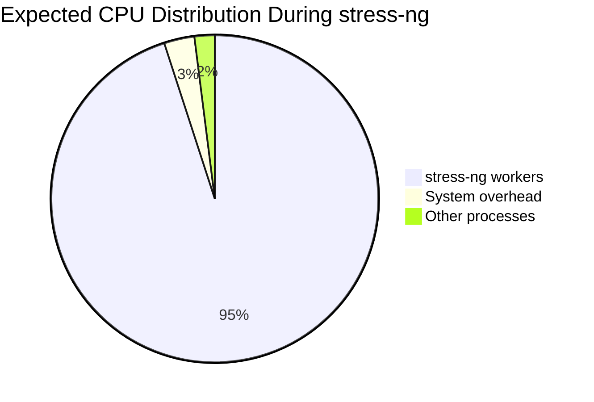
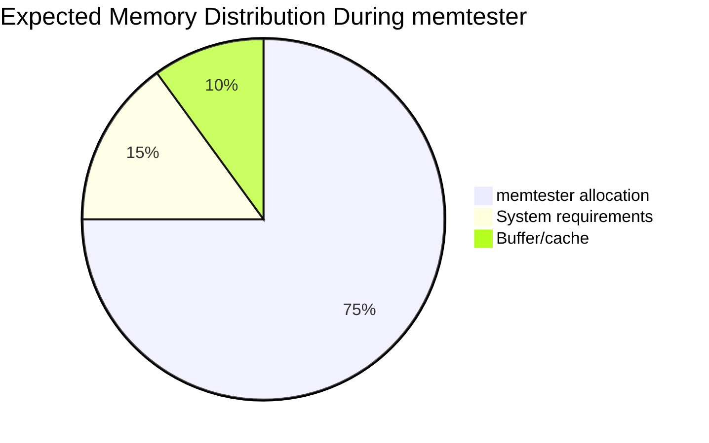
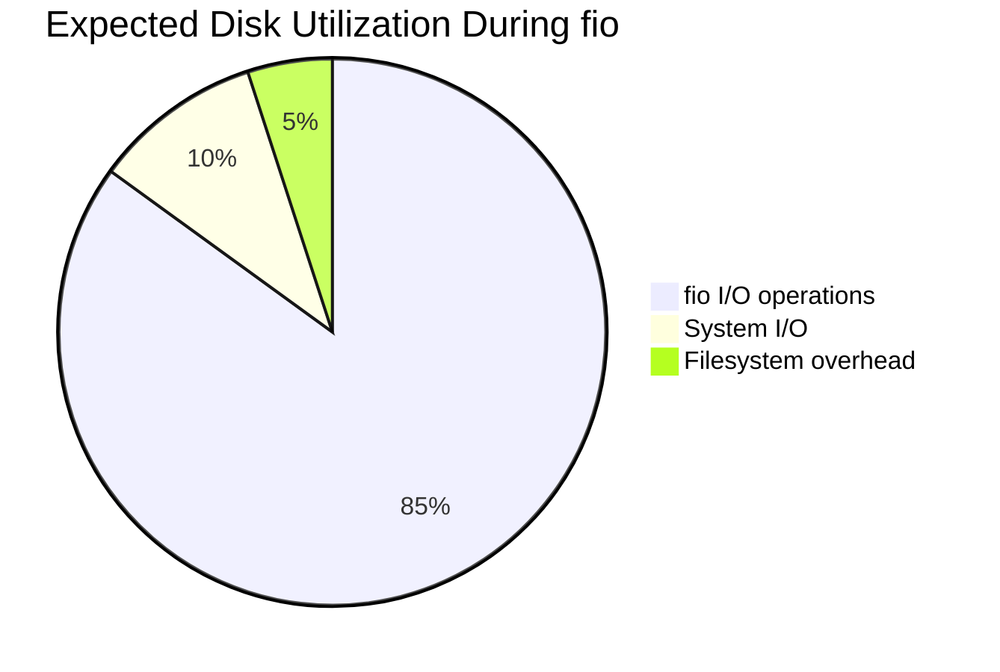
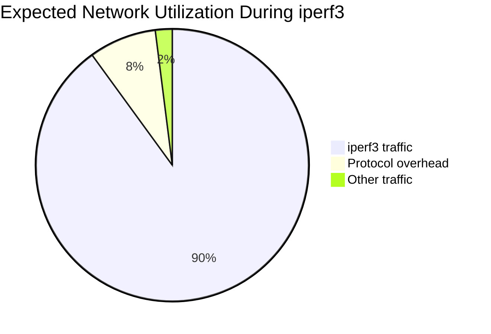
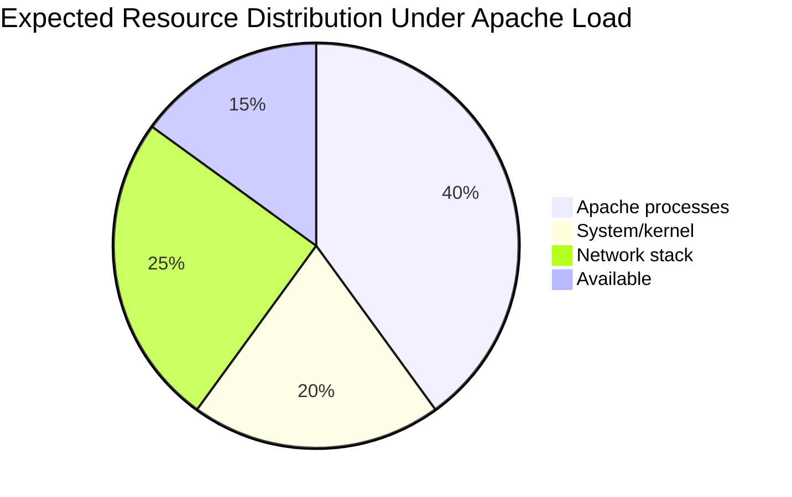
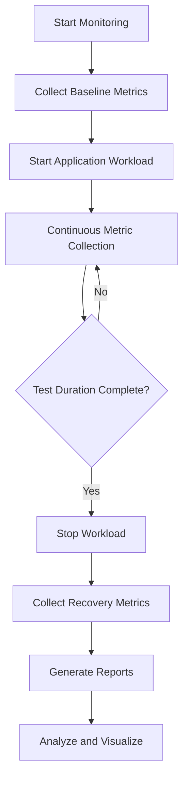

# Phase 3: Application Selection for Performance Testing (Week 3)

## 1. Application Selection Matrix

### Workload Categories and Selected Applications

| Workload Type | Application | Version | Purpose | License |
|--------------|-------------|---------|---------|---------|
| **CPU-Intensive** | stress-ng | Latest | CPU stress testing | GPL v2 |
| **RAM-Intensive** | memtester | 4.5.1 | Memory stress testing | GPL v2 |
| **I/O-Intensive** | fio | 3.x | Disk I/O benchmarking | GPL v2 |
| **Network-Intensive** | iperf3 | 3.x | Network throughput testing | BSD |
| **Server Application** | Apache HTTP Server | 2.4.x | Web server workload | Apache 2.0 |

### Detailed Justifications



#### CPU-Intensive: stress-ng

| Criterion | Rating | Justification |
|-----------|--------|---------------|
| Comprehensive stress tests | ⭐⭐⭐⭐⭐ | 70+ CPU stressors available |
| Metrics output | ⭐⭐⭐⭐⭐ | Built-in statistics reporting |
| Configurability | ⭐⭐⭐⭐⭐ | Fine-grained control over workload |
| Resource footprint | ⭐⭐⭐⭐ | Minimal overhead |
| Documentation | ⭐⭐⭐⭐ | Well-documented man pages |

**Why stress-ng over alternatives:**
- **vs. stress**: stress-ng offers more stressor types and better metrics
- **vs. cpuburn**: stress-ng safer and more controllable
- **vs. sysbench**: stress-ng more focused on system stress testing

---

#### RAM-Intensive: memtester

| Criterion | Rating | Justification |
|-----------|--------|---------------|
| Memory testing accuracy | ⭐⭐⭐⭐⭐ | Comprehensive memory pattern tests |
| Simplicity | ⭐⭐⭐⭐⭐ | Single-purpose, easy to use |
| Reliability | ⭐⭐⭐⭐⭐ | Industry-standard tool |
| Low dependencies | ⭐⭐⭐⭐⭐ | No external dependencies |
| Error detection | ⭐⭐⭐⭐ | Reports memory issues clearly |

**Why memtester over alternatives:**
- **vs. stress-ng --vm**: memtester specifically designed for RAM testing
- **vs. memtest86**: memtester runs in userspace (no reboot needed)
- **vs. custom scripts**: memtester is proven and standardized

---

#### I/O-Intensive: fio (Flexible I/O Tester)

| Criterion | Rating | Justification |
|-----------|--------|---------------|
| I/O pattern variety | ⭐⭐⭐⭐⭐ | Sequential, random, mixed patterns |
| Output formats | ⭐⭐⭐⭐⭐ | JSON, CSV, human-readable |
| Configurability | ⭐⭐⭐⭐⭐ | Job files for complex scenarios |
| Industry adoption | ⭐⭐⭐⭐⭐ | Standard benchmarking tool |
| Accuracy | ⭐⭐⭐⭐⭐ | Precise IOPS and throughput |

**Why fio over alternatives:**
- **vs. dd**: fio offers advanced I/O patterns and statistics
- **vs. bonnie++**: fio more flexible and scriptable
- **vs. iozone**: fio more actively maintained

---

#### Network-Intensive: iperf3

| Criterion | Rating | Justification |
|-----------|--------|---------------|
| Throughput measurement | ⭐⭐⭐⭐⭐ | Accurate bandwidth testing |
| Protocol support | ⭐⭐⭐⭐ | TCP, UDP, SCTP |
| JSON output | ⭐⭐⭐⭐⭐ | Easy parsing for automation |
| Client-server model | ⭐⭐⭐⭐⭐ | Matches our workstation-server setup |
| Lightweight | ⭐⭐⭐⭐⭐ | Minimal resource usage |

**Why iperf3 over alternatives:**
- **vs. iperf2**: iperf3 newer, better JSON output
- **vs. netperf**: iperf3 simpler to use
- **vs. nuttcp**: iperf3 more widely supported

---

#### Server Application: Apache HTTP Server

| Criterion | Rating | Justification |
|-----------|--------|---------------|
| Industry standard | ⭐⭐⭐⭐⭐ | Most widely used web server |
| Configurability | ⭐⭐⭐⭐⭐ | Extensive module system |
| Load testing tools | ⭐⭐⭐⭐⭐ | ab (ApacheBench) included |
| Documentation | ⭐⭐⭐⭐⭐ | Comprehensive official docs |
| Performance tuning | ⭐⭐⭐⭐ | MPM modules for optimization |

**Why Apache over alternatives:**
- **vs. Nginx**: Apache easier to configure for coursework
- **vs. Lighttpd**: Apache more feature-rich
- **vs. custom server**: Apache provides reliable baseline

---

## 2. Installation Documentation

### SSH-Based Installation Commands

All commands executed remotely via SSH from workstation:

```bash
# SSH connection command (from workstation)
ssh adminuser@192.168.56.10
```

#### System Update (Prerequisite)

```bash
# Update package lists
sudo apt update

# Upgrade existing packages
sudo apt upgrade -y
```

#### stress-ng Installation

```bash
# Install stress-ng for CPU testing
sudo apt install stress-ng -y

# Verify installation
stress-ng --version
# Expected output: stress-ng, version 0.13.x
```

#### memtester Installation

```bash
# Install memtester for RAM testing
sudo apt install memtester -y

# Verify installation
memtester --version 2>&1 | head -1
# Expected output: memtester version 4.5.1
```

#### fio Installation

```bash
# Install fio for I/O testing
sudo apt install fio -y

# Verify installation
fio --version
# Expected output: fio-3.x
```

#### iperf3 Installation

```bash
# Install iperf3 for network testing
sudo apt install iperf3 -y

# Verify installation
iperf3 --version
# Expected output: iperf 3.x
```

#### Apache HTTP Server Installation

```bash
# Install Apache web server
sudo apt install apache2 -y

# Enable Apache to start on boot
sudo systemctl enable apache2

# Start Apache service
sudo systemctl start apache2

# Verify Apache is running
sudo systemctl status apache2

# Test web server
curl http://localhost
```

### Installation Verification Script

```bash
#!/bin/bash
# Save as verify-installation.sh

echo "=== Application Installation Verification ==="

echo -e "\n[1] stress-ng:"
stress-ng --version 2>/dev/null && echo "✓ Installed" || echo "✗ Not found"

echo -e "\n[2] memtester:"
memtester 2>&1 | head -1 && echo "✓ Installed" || echo "✗ Not found"

echo -e "\n[3] fio:"
fio --version 2>/dev/null && echo "✓ Installed" || echo "✗ Not found"

echo -e "\n[4] iperf3:"
iperf3 --version 2>/dev/null && echo "✓ Installed" || echo "✗ Not found"

echo -e "\n[5] Apache2:"
apache2 -v 2>/dev/null && echo "✓ Installed" || echo "✗ Not found"

echo -e "\n=== Verification Complete ==="
```

---

## 3. Expected Resource Profiles

### Baseline System Resources

| Resource | Baseline Value | Measurement Command |
|----------|----------------|---------------------|
| CPU Usage | 1-5% | `top -bn1 \| grep "Cpu(s)"` |
| Memory Used | 500 MB | `free -m` |
| Disk I/O | < 1 MB/s | `iostat -d 1 1` |
| Network | < 1 Mbps | `iftop` (idle) |

### Application Resource Profiles

#### stress-ng (CPU-Intensive)



| Resource | Expected Under Load | Duration |
|----------|---------------------|----------|
| CPU Usage | 95-100% (all cores) | Test period |
| Memory | 100-200 MB | Minimal |
| Disk I/O | < 1 MB/s | Minimal |
| Network | None | Not used |

**Testing Command:**
```bash
# 4 CPU workers for 60 seconds
stress-ng --cpu 4 --cpu-load 90 --timeout 60s --metrics
```

---

#### memtester (RAM-Intensive)



| Resource | Expected Under Load | Notes |
|----------|---------------------|-------|
| CPU Usage | 30-50% | Memory operations |
| Memory | 1-3 GB (configurable) | Main resource |
| Disk I/O | Swap if needed | Should avoid |
| Network | None | Not used |

**Testing Command:**
```bash
# Test 1GB of memory, 2 iterations
sudo memtester 1G 2
```

---

#### fio (I/O-Intensive)



| Resource | Expected Under Load | Notes |
|----------|---------------------|-------|
| CPU Usage | 10-30% | I/O wait increases |
| Memory | 500 MB | Buffer allocations |
| Disk I/O | 100-500 MB/s | Saturates disk |
| Network | None | Local disk only |

**Testing Command:**
```bash
# Random read/write test
fio --name=random-rw --ioengine=libaio --rw=randrw \
    --bs=4k --size=1G --numjobs=4 --runtime=60 \
    --time_based --group_reporting
```

---

#### iperf3 (Network-Intensive)



| Resource | Expected Under Load | Notes |
|----------|---------------------|-------|
| CPU Usage | 5-20% | Network processing |
| Memory | 50-100 MB | Buffer allocations |
| Disk I/O | Minimal | Memory-based |
| Network | ~1 Gbps | Saturates virtual NIC |

**Testing Commands:**
```bash
# Server side
iperf3 -s

# Client side (from workstation)
iperf3 -c 192.168.56.10 -t 60 -P 4
```

---

#### Apache HTTP Server



| Resource | Idle | Under Load (100 concurrent) |
|----------|------|------------------------------|
| CPU Usage | 1-2% | 30-60% |
| Memory | 100 MB | 500 MB - 1 GB |
| Disk I/O | < 1 MB/s | 10-50 MB/s |
| Network | < 1 Mbps | 50-200 Mbps |

**Load Testing Command:**
```bash
# ApacheBench: 10000 requests, 100 concurrent
ab -n 10000 -c 100 http://192.168.56.10/
```

---

## 4. Monitoring Strategy

### Measurement Approach Overview



### Metrics Collection Tools

| Metric Category | Tool | Command | Output Format |
|-----------------|------|---------|---------------|
| CPU | top/mpstat | `mpstat -P ALL 1` | Text/parseable |
| Memory | free | `free -s 1` | Text |
| Disk I/O | iostat | `iostat -dx 1` | Text |
| Network | iftop/nethogs | `iftop -t` | Text |
| Combined | sar | `sar -u -r -d 1` | Text |
| Custom | monitor-server.sh | SSH-based | CSV |

### Per-Application Monitoring Strategy

#### stress-ng Monitoring

| Metric | Tool | Collection Interval | Key Indicators |
|--------|------|---------------------|----------------|
| CPU % per core | mpstat | 1 second | %usr, %sys |
| Load average | uptime | 5 seconds | 1/5/15 min |
| Process states | ps aux | 5 seconds | CPU time |
| Temperature | sensors | 5 seconds | Core temps |

**Commands:**
```bash
# Comprehensive CPU monitoring
mpstat -P ALL 1 60

# Process-specific monitoring
pidstat -u 1 60

# stress-ng internal metrics
stress-ng --cpu 4 --timeout 60s --metrics-brief
```

---

#### memtester Monitoring

| Metric | Tool | Collection Interval | Key Indicators |
|--------|------|---------------------|----------------|
| Memory usage | free -m | 1 second | Used, available |
| Swap usage | free -m | 1 second | Swap used |
| Page faults | vmstat | 1 second | si, so |
| OOM events | dmesg | Continuous | OOM killer |

**Commands:**
```bash
# Memory monitoring during test
watch -n1 'free -m'

# Virtual memory statistics
vmstat 1 60

# Memory pressure
cat /proc/meminfo | grep -E "(MemFree|Buffers|Cached)"
```

---

#### fio Monitoring

| Metric | Tool | Collection Interval | Key Indicators |
|--------|------|---------------------|----------------|
| IOPS | iostat -x | 1 second | r/s, w/s |
| Throughput | iostat | 1 second | MB/s |
| Latency | fio output | Per test | avg lat |
| Queue depth | iostat | 1 second | avgqu-sz |

**Commands:**
```bash
# Disk I/O monitoring
iostat -dxm 1 60

# I/O wait monitoring
vmstat 1 60 | awk '{print $16}'  # wa column

# fio JSON output for analysis
fio --output-format=json --output=fio-results.json ...
```

---

#### iperf3 Monitoring

| Metric | Tool | Collection Interval | Key Indicators |
|--------|------|---------------------|----------------|
| Bandwidth | iperf3 | Per second | Mbits/sec |
| Jitter | iperf3 (UDP) | Per second | ms |
| Packet loss | iperf3 (UDP) | Per test | % |
| Retransmits | iperf3 (TCP) | Per second | count |

**Commands:**
```bash
# Server-side with JSON output
iperf3 -s --json > iperf-server.json

# Client-side with verbose output
iperf3 -c 192.168.56.10 -t 60 -i 1 --json > iperf-client.json

# Network interface statistics
watch -n1 'cat /proc/net/dev'
```

---

#### Apache Monitoring

| Metric | Tool | Collection Interval | Key Indicators |
|--------|------|---------------------|----------------|
| Requests/sec | ab output | Per test | Requests/sec |
| Response time | ab output | Per test | Time per request |
| Connection errors | ab output | Per test | Failed requests |
| Apache processes | ps | 1 second | Process count |

**Commands:**
```bash
# Enable Apache status module
sudo a2enmod status
sudo systemctl reload apache2

# Monitor Apache status
watch -n1 'curl -s http://localhost/server-status?auto'

# Process monitoring
watch -n1 'ps aux | grep apache2 | wc -l'

# Access log analysis
tail -f /var/log/apache2/access.log
```

---

### Data Collection and Storage

| Data Type | Storage Format | Location | Retention |
|-----------|----------------|----------|-----------|
| Raw metrics | CSV | ~/metrics/ | All tests |
| JSON output | JSON | ~/benchmarks/ | All tests |
| Logs | Text | /var/log/ | 7 days |
| Screenshots | PNG | ~/evidence/ | Permanent |

### Centralized Monitoring Script Location

All monitoring performed via `monitor-server.sh` script (Phase 5) which:
1. Connects to server via SSH
2. Collects all metrics in real-time
3. Stores data in timestamped CSV files
4. Generates summary reports

---

## References

- stress-ng Manual: https://kernel.ubuntu.com/git/cking/stress-ng.git
- fio Documentation: https://fio.readthedocs.io/
- iperf3 Documentation: https://software.es.net/iperf/
- Apache Documentation: https://httpd.apache.org/docs/2.4/
