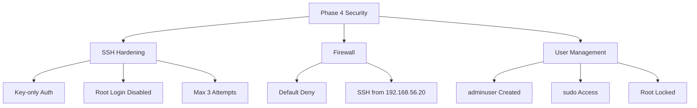

# Phase 4: Initial System Configuration & Security Implementation (Week 4)

## Administrative Constraint Notice

> [!IMPORTANT]
> All server configurations in this phase MUST be performed via SSH from the workstation.
> Direct console access to the server VM should only be used for initial SSH setup.

---

## 1. SSH Key-Based Authentication Configuration

### Step-by-Step Implementation

#### 1.1 Generate SSH Key Pair (On Workstation)

```bash
# Generate a 4096-bit RSA key pair
ssh-keygen -t rsa -b 4096 -C "adminuser@workstation" -f ~/.ssh/id_rsa_server

# Or generate an ED25519 key (more secure, shorter)
ssh-keygen -t ed25519 -C "adminuser@workstation" -f ~/.ssh/id_ed25519_server
```

**Expected Output:**
```
Generating public/private rsa key pair.
Enter passphrase (empty for no passphrase): ********
Enter same passphrase again: ********
Your identification has been saved in /home/adminuser/.ssh/id_rsa_server
Your public key has been saved in /home/adminuser/.ssh/id_rsa_server.pub
The key fingerprint is:
SHA256:... adminuser@workstation
```

#### 1.2 Copy Public Key to Server

```bash
# Copy public key to server
ssh-copy-id -i ~/.ssh/id_rsa_server.pub adminuser@192.168.56.10

# Alternative method using cat and SSH
cat ~/.ssh/id_rsa_server.pub | ssh adminuser@192.168.56.10 "mkdir -p ~/.ssh && cat >> ~/.ssh/authorized_keys"
```

#### 1.3 Test Key-Based Authentication

```bash
# Connect using the new key
ssh -i ~/.ssh/id_rsa_server adminuser@192.168.56.10

# Verify connection
whoami
hostname
```

#### 1.4 Configure SSH Client (Optional Convenience)

Create or edit `~/.ssh/config` on workstation:

```bash
cat >> ~/.ssh/config << 'EOF'
Host server
    HostName 192.168.56.10
    User adminuser
    IdentityFile ~/.ssh/id_rsa_server
    Port 22
EOF
```

Now connect simply with:
```bash
ssh server
```

---

## 2. SSH Server Hardening

### 2.1 Backup Original Configuration

```bash
# Connect to server
ssh server

# Backup original sshd_config
sudo cp /etc/ssh/sshd_config /etc/ssh/sshd_config.backup
```

### 2.2 SSH Configuration Changes

Edit `/etc/ssh/sshd_config`:

```bash
sudo nano /etc/ssh/sshd_config
```

**Before (Original Settings):**
```bash
#PermitRootLogin prohibit-password
#PasswordAuthentication yes
#PubkeyAuthentication yes
#MaxAuthTries 6
#X11Forwarding yes
```

**After (Hardened Settings):**
```bash
# Disable root login completely
PermitRootLogin no

# Disable password authentication (key-only)
PasswordAuthentication no

# Enable public key authentication
PubkeyAuthentication yes

# Limit authentication attempts
MaxAuthTries 3

# Set login grace time (seconds to authenticate)
LoginGraceTime 60

# Disable X11 forwarding (not needed)
X11Forwarding no

# Allow only specific user(s)
AllowUsers adminuser

# Use strong ciphers only
Ciphers aes256-gcm@openssh.com,chacha20-poly1305@openssh.com,aes256-ctr

# Use strong MACs only
MACs hmac-sha2-512-etm@openssh.com,hmac-sha2-256-etm@openssh.com

# Use strong key exchange algorithms
KexAlgorithms curve25519-sha256@libssh.org,diffie-hellman-group-exchange-sha256

# Disable empty passwords
PermitEmptyPasswords no

# Disable TCP forwarding (if not needed)
AllowTcpForwarding no
```

### 2.3 Validate and Apply Configuration

```bash
# Validate configuration syntax
sudo sshd -t

# Restart SSH service
sudo systemctl restart sshd

# Check SSH service status
sudo systemctl status sshd
```

> [!WARNING]
> Keep your existing SSH session open while testing. Open a new terminal and verify you can still connect before closing the original session.

---

## 3. Firewall Configuration (UFW)

### 3.1 Install and Enable UFW

```bash
# Install UFW (if not present)
sudo apt install ufw -y

# Check current status
sudo ufw status
```

### 3.2 Configure Firewall Rules

```bash
# Set default policies
sudo ufw default deny incoming
sudo ufw default allow outgoing

# Allow SSH ONLY from workstation IP
sudo ufw allow from 192.168.56.20 to any port 22 proto tcp comment 'SSH from workstation'

# Enable firewall (type 'y' when prompted)
sudo ufw enable
```

### 3.3 Verify Firewall Configuration

```bash
# Check detailed status
sudo ufw status verbose
```

**Expected Output:**
```
Status: active
Logging: on (low)
Default: deny (incoming), allow (outgoing), disabled (routed)
New profiles: skip

To                         Action      From
--                         ------      ----
22/tcp                     ALLOW IN    192.168.56.20              # SSH from workstation
```

### 3.4 Complete Firewall Ruleset

| Rule # | Direction | Port | Protocol | Source | Action | Description |
|--------|-----------|------|----------|--------|--------|-------------|
| 1 | Incoming | any | any | anywhere | DENY | Default policy |
| 2 | Outgoing | any | any | anywhere | ALLOW | Default policy |
| 3 | Incoming | 22 | TCP | 192.168.56.20 | ALLOW | SSH from workstation |

---

## 4. User Management and Privilege Management

### 4.1 Create Non-Root Administrative User

```bash
# Create new user
sudo adduser adminuser
```

**Interactive prompts:**
```
Adding user 'adminuser' ...
Adding new group 'adminuser' (1001) ...
Adding new user 'adminuser' (1001) with group 'adminuser' ...
Creating home directory '/home/adminuser' ...
Copying files from '/etc/skel' ...
New password: ********
Retype new password: ********
```

### 4.2 Grant Sudo Privileges

```bash
# Add user to sudo group
sudo usermod -aG sudo adminuser

# Verify group membership
groups adminuser
# Expected: adminuser : adminuser sudo
```

### 4.3 Configure Sudo Settings

Edit sudoers file safely:
```bash
sudo visudo
```

Add these lines:
```bash
# Require password for sudo (default, verify it's set)
Defaults        env_reset
Defaults        mail_badpass
Defaults        secure_path="/usr/local/sbin:/usr/local/bin:/usr/sbin:/usr/bin:/sbin:/bin"

# Set sudo session timeout (5 minutes)
Defaults        timestamp_timeout=5

# Log all sudo commands
Defaults        logfile=/var/log/sudo.log
```

### 4.4 Disable Direct Root Login

```bash
# Lock root account password
sudo passwd -l root

# Verify root is locked
sudo passwd -S root
# Expected: root L ... (L = locked)
```

### 4.5 User Account Summary

| User | UID | Groups | Shell | SSH Access | Sudo |
|------|-----|--------|-------|------------|------|
| root | 0 | root | /bin/bash | ❌ Denied | N/A |
| adminuser | 1001 | sudo | /bin/bash | ✅ Key only | ✅ Yes |

---

## 5. Configuration Files: Before and After Comparison

### 5.1 SSH Configuration (/etc/ssh/sshd_config)

```diff
# Key security changes made:

- #PermitRootLogin prohibit-password
+ PermitRootLogin no

- #PasswordAuthentication yes
+ PasswordAuthentication no

- #PubkeyAuthentication yes
+ PubkeyAuthentication yes

- #MaxAuthTries 6
+ MaxAuthTries 3

- #X11Forwarding yes
+ X11Forwarding no

+ AllowUsers adminuser
+ LoginGraceTime 60
```

### 5.2 User Configuration Summary

| Config | Before | After |
|--------|--------|-------|
| Root SSH login | Allowed | Denied |
| Password auth | Enabled | Disabled |
| Admin user | None | adminuser (sudo) |
| SSH keys | None | RSA-4096/ED25519 |

### 5.3 Firewall Configuration

| State | Before | After |
|-------|--------|-------|
| UFW Status | Inactive | Active |
| Default Incoming | Allow | Deny |
| SSH Access | Any source | 192.168.56.20 only |

---

## 6. SSH Access Evidence

### Connection Test from Workstation

```bash
# From workstation terminal
ssh adminuser@192.168.56.10

# Expected successful connection:
# Welcome to Ubuntu 22.04.3 LTS
# Last login: [timestamp] from 192.168.56.20
```

### Verification Commands (Run on Server via SSH)

```bash
# Verify logged in user
whoami
# Output: adminuser

# Verify hostname
hostname
# Output: server

# Verify you're not root
id
# Output: uid=1001(adminuser) gid=1001(adminuser) groups=1001(adminuser),27(sudo)

# Verify sudo works
sudo whoami
# Output: root
```

### Failed Access Attempts (Evidence)

```bash
# From an unauthorized IP (if available for testing)
# This should fail:
ssh adminuser@192.168.56.10 -o ConnectTimeout=5
# Expected: Connection refused or timed out

# Password authentication should fail even with valid password:
ssh -o PubkeyAuthentication=no adminuser@192.168.56.10
# Expected: Permission denied (publickey)
```

---

## 7. Remote Administration Evidence

### Example Administrative Commands via SSH

```bash
# Connect to server
ssh server

# System update (via SSH)
sudo apt update && sudo apt upgrade -y

# Check system resources
free -h
df -h

# Check running services
systemctl list-units --type=service --state=running

# View system logs
sudo journalctl -n 50

# Restart a service
sudo systemctl restart apache2

# Check firewall status
sudo ufw status verbose

# View login attempts
sudo journalctl -u ssh | tail -20
```

### Remote File Transfer Examples

```bash
# Copy file to server (from workstation)
scp localfile.txt server:/home/adminuser/

# Copy file from server (from workstation)
scp server:/home/adminuser/remotefile.txt ./

# Sync directories
rsync -avz ./local-dir/ server:/home/adminuser/remote-dir/
```

### Remote Script Execution

```bash
# Execute single command remotely
ssh server 'uname -a'

# Execute script remotely
ssh server 'bash -s' < local-script.sh

# Run interactive session with specific command
ssh -t server 'sudo htop'
```

---

## 8. Firewall Documentation

### Complete UFW Rule Reference

```bash
# Current complete ruleset
sudo ufw status numbered
```

**Output:**
```
Status: active

     To                         Action      From
     --                         ------      ----
[ 1] 22/tcp                     ALLOW IN    192.168.56.20
```

### UFW Management Commands Reference

| Task | Command |
|------|---------|
| Check status | `sudo ufw status verbose` |
| Enable firewall | `sudo ufw enable` |
| Disable firewall | `sudo ufw disable` |
| Reset rules | `sudo ufw reset` |
| Add rule | `sudo ufw allow from <IP> to any port <PORT>` |
| Delete rule | `sudo ufw delete <rule-number>` |
| Reload rules | `sudo ufw reload` |
| View app profiles | `sudo ufw app list` |
| Enable logging | `sudo ufw logging on` |

### iptables Backend (Reference)

```bash
# View underlying iptables rules
sudo iptables -L -n -v

# Save current rules
sudo iptables-save > ~/iptables-backup.rules
```

---

## Configuration Verification Checklist

| Item | Verification Command | Expected Result | Status |
|------|---------------------|-----------------|--------|
| SSH key login | `ssh server` | Login successful | ☐ |
| Password disabled | `ssh -o PubkeyAuth=no server` | Permission denied | ☐ |
| Root login disabled | `ssh root@server` | Permission denied | ☐ |
| UFW enabled | `sudo ufw status` | Status: active | ☐ |
| SSH restricted | `sudo ufw status verbose` | 22/tcp from 192.168.56.20 | ☐ |
| Admin user exists | `id adminuser` | User details shown | ☐ |
| Sudo configured | `sudo whoami` | root | ☐ |
| Root locked | `sudo passwd -S root` | root L ... | ☐ |

---

## Security Implementation Summary



---

## References

- Ubuntu SSH Documentation: https://ubuntu.com/server/docs/service-openssh
- UFW Documentation: https://help.ubuntu.com/community/UFW
- SSH Key Authentication: https://www.ssh.com/academy/ssh/keygen
