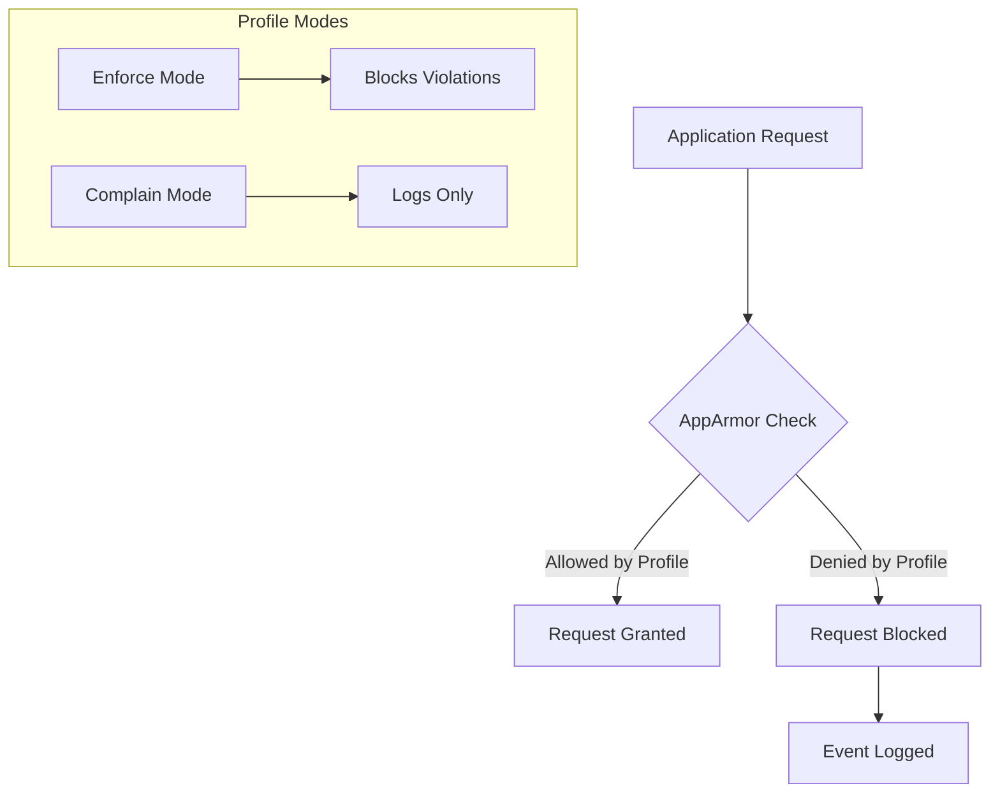

# Phase 5: Advanced Security and Monitoring Infrastructure (Week 5)

## Overview

This phase implements advanced security controls including:
- Mandatory Access Control (AppArmor)
- Automatic security updates
- Intrusion detection (fail2ban)
- Security baseline verification script
- Remote monitoring script

> [!IMPORTANT]
> All implementations must be demonstrated in video with live command execution and explanation.

---

## 1. Mandatory Access Control: AppArmor Implementation

### 1.1 Understanding AppArmor

AppArmor (Application Armor) is a Linux Security Module that provides Mandatory Access Control (MAC). It restricts programs' capabilities based on per-program profiles.



### 1.2 Verify AppArmor Status

```bash
# Connect to server via SSH
ssh server

# Check if AppArmor is running
sudo systemctl status apparmor

# View AppArmor status summary
sudo aa-status
```

**Expected Output:**
```
apparmor module is loaded.
54 profiles are loaded.
48 profiles are in enforce mode.
6 profiles are in complain mode.
```

### 1.3 AppArmor Profile Modes

| Mode | Description | Use Case |
|------|-------------|----------|
| **Enforce** | Blocks and logs policy violations | Production |
| **Complain** | Logs but allows violations | Testing/Debugging |
| **Disabled** | Profile not active | Troubleshooting |

### 1.4 Installing AppArmor Utilities

```bash
# Install additional AppArmor tools
sudo apt install apparmor-utils apparmor-profiles apparmor-profiles-extra -y
```

### 1.5 Managing AppArmor Profiles

```bash
# List all profiles
sudo aa-status

# Put a profile in enforce mode
sudo aa-enforce /etc/apparmor.d/usr.sbin.apache2

# Put a profile in complain mode (for testing)
sudo aa-complain /etc/apparmor.d/usr.sbin.apache2

# Disable a profile
sudo aa-disable /etc/apparmor.d/usr.sbin.apache2

# Reload all profiles
sudo systemctl reload apparmor
```

### 1.6 Creating a Custom AppArmor Profile

Example: Creating a restrictive profile for a custom application

```bash
# Generate a profile template
sudo aa-genprof /path/to/application

# Or manually create a profile
sudo nano /etc/apparmor.d/local/custom-app
```

**Example Profile:**
```
#include <tunables/global>

/usr/local/bin/myapp {
  #include <abstractions/base>
  
  # Allow reading configuration
  /etc/myapp/** r,
  
  # Allow writing to log directory
  /var/log/myapp/** rw,
  
  # Network access
  network inet tcp,
  
  # Deny everything else by default
}
```

### 1.7 Tracking and Reporting Access Control Settings

```bash
# View all enforced profiles
sudo aa-status --enforced

# View recent AppArmor denials in logs
sudo journalctl -k | grep apparmor

# Alternative: Check audit log
sudo cat /var/log/audit/audit.log | grep apparmor 2>/dev/null || echo "Audit log not available"

# View detailed profile information
sudo apparmor_parser -p /etc/apparmor.d/usr.sbin.apache2
```

### 1.8 AppArmor Reporting Script

```bash
#!/bin/bash
# Save as apparmor-report.sh

echo "=========================================="
echo "AppArmor Status Report - $(date)"
echo "=========================================="

echo -e "\n[1] AppArmor Module Status:"
if [ -f /sys/module/apparmor/parameters/enabled ]; then
    ENABLED=$(cat /sys/module/apparmor/parameters/enabled)
    [ "$ENABLED" == "Y" ] && echo "✓ AppArmor is enabled" || echo "✗ AppArmor is disabled"
else
    echo "✗ AppArmor module not loaded"
fi

echo -e "\n[2] Profile Statistics:"
sudo aa-status --profiled 2>/dev/null

echo -e "\n[3] Enforced Profiles:"
sudo aa-status --enforced 2>/dev/null | head -20

echo -e "\n[4] Complain Mode Profiles:"
sudo aa-status --complaining 2>/dev/null

echo -e "\n[5] Recent Denials (last 10):"
sudo journalctl -k | grep -i "apparmor.*DENIED" | tail -10 || echo "No recent denials found"

echo -e "\n=========================================="
echo "Report Complete"
echo "=========================================="
```

---

## 2. Automatic Security Updates Configuration

### 2.1 Install unattended-upgrades

```bash
# Install the package
sudo apt install unattended-upgrades -y

# Enable automatic updates
sudo dpkg-reconfigure -plow unattended-upgrades
# Select "Yes" when prompted
```

### 2.2 Configure Update Settings

Edit the configuration file:
```bash
sudo nano /etc/apt/apt.conf.d/50unattended-upgrades
```

**Key Configuration Options:**

```bash
// Enable security updates
Unattended-Upgrade::Allowed-Origins {
    "${distro_id}:${distro_codename}";
    "${distro_id}:${distro_codename}-security";
    "${distro_id}ESMApps:${distro_codename}-apps-security";
    "${distro_id}ESM:${distro_codename}-infra-security";
};

// Auto-remove unused kernel packages
Unattended-Upgrade::Remove-Unused-Kernel-Packages "true";

// Auto-remove unused dependencies
Unattended-Upgrade::Remove-Unused-Dependencies "true";

// Automatic reboot if needed (set time)
Unattended-Upgrade::Automatic-Reboot "true";
Unattended-Upgrade::Automatic-Reboot-Time "02:00";

// Email notification (optional)
Unattended-Upgrade::Mail "admin@example.com";
Unattended-Upgrade::MailReport "on-change";
```

### 2.3 Enable Automatic Updates Timer

```bash
# Configure auto-update schedule
sudo nano /etc/apt/apt.conf.d/20auto-upgrades
```

**Content:**
```bash
APT::Periodic::Update-Package-Lists "1";
APT::Periodic::Download-Upgradeable-Packages "1";
APT::Periodic::AutocleanInterval "7";
APT::Periodic::Unattended-Upgrade "1";
```

### 2.4 Verify Configuration

```bash
# Check if unattended-upgrades is enabled
sudo systemctl status unattended-upgrades

# Test the configuration (dry run)
sudo unattended-upgrades --dry-run --debug

# View upgrade logs
sudo cat /var/log/unattended-upgrades/unattended-upgrades.log
```

### 2.5 Evidence of Implementation

```bash
# Check last update timestamp
ls -la /var/lib/apt/periodic/

# View scheduled updates
sudo systemctl list-timers | grep apt

# Expected output:
# apt-daily.timer
# apt-daily-upgrade.timer
```

---

## 3. fail2ban Configuration for Intrusion Detection

### 3.1 Install fail2ban

```bash
# Install fail2ban
sudo apt install fail2ban -y

# Enable at boot
sudo systemctl enable fail2ban

# Start the service
sudo systemctl start fail2ban
```

### 3.2 Configure fail2ban

Create local configuration (overrides defaults safely):
```bash
sudo cp /etc/fail2ban/jail.conf /etc/fail2ban/jail.local
sudo nano /etc/fail2ban/jail.local
```

**Key Configuration Settings:**

```ini
[DEFAULT]
# Ban time (in seconds) - 1 hour
bantime = 3600

# Time window for failed attempts
findtime = 600

# Number of failures before ban
maxretry = 3

# Email notifications (optional)
destemail = admin@example.com
sender = fail2ban@server
action = %(action_mwl)s

# Ignore local IPs
ignoreip = 127.0.0.1/8 ::1

[sshd]
# Enable SSH jail
enabled = true
port = ssh
filter = sshd
logpath = /var/log/auth.log
maxretry = 3
bantime = 3600
findtime = 600
```

### 3.3 Restart and Verify fail2ban

```bash
# Restart to apply changes
sudo systemctl restart fail2ban

# Check status
sudo systemctl status fail2ban

# View active jails
sudo fail2ban-client status

# View SSH jail details
sudo fail2ban-client status sshd
```

**Expected Output:**
```
Status for the jail: sshd
|- Filter
|  |- Currently failed: 0
|  |- Total failed: 0
|  `- File list:    /var/log/auth.log
`- Actions
   |- Currently banned: 0
   |- Total banned:     0
   `- Banned IP list:
```

### 3.4 fail2ban Management Commands

| Task | Command |
|------|---------|
| Check status | `sudo fail2ban-client status` |
| Check jail | `sudo fail2ban-client status sshd` |
| Ban IP manually | `sudo fail2ban-client set sshd banip <IP>` |
| Unban IP | `sudo fail2ban-client set sshd unbanip <IP>` |
| View banned IPs | `sudo fail2ban-client get sshd banned` |
| Reload config | `sudo fail2ban-client reload` |
| View logs | `sudo tail -f /var/log/fail2ban.log` |

### 3.5 Testing fail2ban (Carefully)

```bash
# Monitor fail2ban log while testing
sudo tail -f /var/log/fail2ban.log

# From ANOTHER machine (not the workstation), attempt multiple failed logins
# The IP should be banned after 3 attempts

# View banned IPs
sudo fail2ban-client status sshd
```

---

## 4. Security Baseline Verification Script

**File: `/home/adminuser/scripts/security-baseline.sh`**

```bash
#!/bin/bash
#==============================================================================
# security-baseline.sh
# Purpose: Verify all security configurations from Phases 4 and 5
# Author: Administration Team
# Usage: Run via SSH from workstation: ssh server 'bash security-baseline.sh'
#==============================================================================

# Color definitions for output formatting
# GREEN indicates a passing check, RED indicates a failing check
# YELLOW indicates a warning that needs attention
GREEN='\033[0;32m'   # Success color
RED='\033[0;31m'     # Failure color
YELLOW='\033[1;33m'  # Warning color
NC='\033[0m'         # No Color (reset)

# Counter variables to track pass/fail statistics
# These are incremented by the check functions
PASS_COUNT=0   # Number of passed checks
FAIL_COUNT=0   # Number of failed checks

#------------------------------------------------------------------------------
# Function: pass
# Purpose: Print a success message and increment pass counter
# Arguments: $1 - Description of the check that passed
#------------------------------------------------------------------------------
pass() {
    echo -e "${GREEN}[PASS]${NC} $1"
    ((PASS_COUNT++))
}

#------------------------------------------------------------------------------
# Function: fail
# Purpose: Print a failure message and increment fail counter
# Arguments: $1 - Description of the check that failed
#------------------------------------------------------------------------------
fail() {
    echo -e "${RED}[FAIL]${NC} $1"
    ((FAIL_COUNT++))
}

#------------------------------------------------------------------------------
# Function: warn
# Purpose: Print a warning message (doesn't affect pass/fail count)
# Arguments: $1 - Description of the warning
#------------------------------------------------------------------------------
warn() {
    echo -e "${YELLOW}[WARN]${NC} $1"
}

# Print script header with timestamp
echo "=============================================="
echo " Security Baseline Verification Script"
echo " Date: $(date '+%Y-%m-%d %H:%M:%S')"
echo " Hostname: $(hostname)"
echo "=============================================="

#==============================================================================
# SECTION 1: SSH Configuration Checks
# Verifies all SSH hardening settings from Phase 4
#==============================================================================
echo -e "\n[1] SSH CONFIGURATION CHECKS"
echo "----------------------------------------------"

# Check 1.1: Verify root login is disabled
# Security: Prevents direct root access via SSH
if grep -q "^PermitRootLogin no" /etc/ssh/sshd_config; then
    pass "Root login is disabled"
else
    fail "Root login is NOT disabled"
fi

# Check 1.2: Verify password authentication is disabled
# Security: Forces use of SSH keys, preventing brute force attacks
if grep -q "^PasswordAuthentication no" /etc/ssh/sshd_config; then
    pass "Password authentication is disabled"
else
    fail "Password authentication is NOT disabled"
fi

# Check 1.3: Verify public key authentication is enabled
# Security: Ensures key-based authentication is available
if grep -q "^PubkeyAuthentication yes" /etc/ssh/sshd_config; then
    pass "Public key authentication is enabled"
else
    fail "Public key authentication is NOT enabled"
fi

# Check 1.4: Verify MaxAuthTries is set to 3 or less
# Security: Limits brute force attempt window
MAX_TRIES=$(grep "^MaxAuthTries" /etc/ssh/sshd_config | awk '{print $2}')
if [ ! -z "$MAX_TRIES" ] && [ "$MAX_TRIES" -le 3 ]; then
    pass "MaxAuthTries is set to $MAX_TRIES"
else
    fail "MaxAuthTries is not configured or too high"
fi

# Check 1.5: Verify SSH service is running
# Operational: Ensures SSH daemon is active
if systemctl is-active --quiet sshd || systemctl is-active --quiet ssh; then
    pass "SSH service is running"
else
    fail "SSH service is NOT running"
fi

#==============================================================================
# SECTION 2: Firewall (UFW) Checks
# Verifies firewall configuration from Phase 4
#==============================================================================
echo -e "\n[2] FIREWALL (UFW) CHECKS"
echo "----------------------------------------------"

# Check 2.1: Verify UFW is enabled
# Security: Ensures firewall is actively protecting the system
if sudo ufw status | grep -q "Status: active"; then
    pass "UFW firewall is active"
else
    fail "UFW firewall is NOT active"
fi

# Check 2.2: Verify default incoming policy is deny
# Security: Blocks all incoming traffic by default
if sudo ufw status verbose | grep -q "deny (incoming)"; then
    pass "Default incoming policy is DENY"
else
    fail "Default incoming policy is NOT deny"
fi

# Check 2.3: Verify SSH is allowed only from workstation IP
# Security: Restricts SSH access to trusted source only
if sudo ufw status | grep -q "22.*ALLOW.*192.168.56.20"; then
    pass "SSH allowed only from 192.168.56.20"
else
    warn "SSH restriction to 192.168.56.20 not found"
fi

#==============================================================================
# SECTION 3: User and Privilege Management Checks
# Verifies user configuration from Phase 4
#==============================================================================
echo -e "\n[3] USER MANAGEMENT CHECKS"
echo "----------------------------------------------"

# Check 3.1: Verify adminuser exists
# Operational: Confirms administrative user is present
if id adminuser &>/dev/null; then
    pass "User 'adminuser' exists"
else
    fail "User 'adminuser' does NOT exist"
fi

# Check 3.2: Verify adminuser is in sudo group
# Security: Confirms admin has proper privileges
if groups adminuser | grep -q sudo; then
    pass "User 'adminuser' is in sudo group"
else
    fail "User 'adminuser' is NOT in sudo group"
fi

# Check 3.3: Verify root account is locked
# Security: Prevents direct root password login
if sudo passwd -S root | grep -q " L "; then
    pass "Root account is locked"
else
    warn "Root account may not be locked"
fi

#==============================================================================
# SECTION 4: AppArmor Checks
# Verifies Mandatory Access Control from Phase 5
#==============================================================================
echo -e "\n[4] APPARMOR (MAC) CHECKS"
echo "----------------------------------------------"

# Check 4.1: Verify AppArmor is enabled
# Security: Ensures MAC is protecting applications
if [ -f /sys/module/apparmor/parameters/enabled ]; then
    ENABLED=$(cat /sys/module/apparmor/parameters/enabled)
    if [ "$ENABLED" == "Y" ]; then
        pass "AppArmor is enabled"
    else
        fail "AppArmor is NOT enabled"
    fi
else
    fail "AppArmor module not found"
fi

# Check 4.2: Verify AppArmor service is running
# Operational: Confirms AppArmor daemon is active
if systemctl is-active --quiet apparmor; then
    pass "AppArmor service is running"
else
    fail "AppArmor service is NOT running"
fi

# Check 4.3: Count enforced profiles
# Security: Confirms profiles are actively enforcing policies
ENFORCED=$(sudo aa-status 2>/dev/null | grep "profiles are in enforce" | awk '{print $1}')
if [ ! -z "$ENFORCED" ] && [ "$ENFORCED" -gt 0 ]; then
    pass "AppArmor has $ENFORCED profiles in enforce mode"
else
    warn "No AppArmor profiles in enforce mode"
fi

#==============================================================================
# SECTION 5: Automatic Updates Checks
# Verifies unattended-upgrades from Phase 5
#==============================================================================
echo -e "\n[5] AUTOMATIC UPDATES CHECKS"
echo "----------------------------------------------"

# Check 5.1: Verify unattended-upgrades is installed
# Operational: Confirms auto-update package is present
if dpkg -l | grep -q unattended-upgrades; then
    pass "unattended-upgrades is installed"
else
    fail "unattended-upgrades is NOT installed"
fi

# Check 5.2: Verify auto-updates are enabled
# Security: Ensures system receives security patches automatically
if [ -f /etc/apt/apt.conf.d/20auto-upgrades ]; then
    if grep -q 'APT::Periodic::Unattended-Upgrade "1"' /etc/apt/apt.conf.d/20auto-upgrades; then
        pass "Automatic updates are enabled"
    else
        fail "Automatic updates are NOT enabled"
    fi
else
    fail "Auto-upgrade configuration file not found"
fi

# Check 5.3: Verify unattended-upgrades service is running
# Operational: Confirms auto-update service is active
if systemctl is-active --quiet unattended-upgrades; then
    pass "unattended-upgrades service is running"
else
    warn "unattended-upgrades service may not be running"
fi

#==============================================================================
# SECTION 6: fail2ban Checks
# Verifies intrusion detection from Phase 5
#==============================================================================
echo -e "\n[6] FAIL2BAN CHECKS"
echo "----------------------------------------------"

# Check 6.1: Verify fail2ban is installed
# Security: Confirms intrusion detection package is present
if dpkg -l | grep -q fail2ban; then
    pass "fail2ban is installed"
else
    fail "fail2ban is NOT installed"
fi

# Check 6.2: Verify fail2ban service is running
# Operational: Confirms fail2ban daemon is active
if systemctl is-active --quiet fail2ban; then
    pass "fail2ban service is running"
else
    fail "fail2ban service is NOT running"
fi

# Check 6.3: Verify SSH jail is enabled
# Security: Confirms SSH is protected by fail2ban
if sudo fail2ban-client status sshd &>/dev/null; then
    pass "fail2ban SSH jail is active"
else
    fail "fail2ban SSH jail is NOT active"
fi

#==============================================================================
# SECTION 7: Network Security Checks
# Additional network hardening verification
#==============================================================================
echo -e "\n[7] NETWORK SECURITY CHECKS"
echo "----------------------------------------------"

# Check 7.1: Verify no unexpected listening ports
# Security: Identifies potentially unwanted services
LISTENING_PORTS=$(sudo ss -tuln | grep LISTEN | wc -l)
if [ "$LISTENING_PORTS" -lt 10 ]; then
    pass "Minimal listening ports: $LISTENING_PORTS services"
else
    warn "Many listening ports detected: $LISTENING_PORTS services"
fi

# Check 7.2: Verify IP forwarding is disabled
# Security: Prevents system from acting as a router
IP_FORWARD=$(cat /proc/sys/net/ipv4/ip_forward)
if [ "$IP_FORWARD" == "0" ]; then
    pass "IP forwarding is disabled"
else
    warn "IP forwarding is enabled"
fi

#==============================================================================
# FINAL SUMMARY
# Display overall security posture
#==============================================================================
echo -e "\n=============================================="
echo " SECURITY BASELINE SUMMARY"
echo "=============================================="
echo -e " Passed: ${GREEN}$PASS_COUNT${NC}"
echo -e " Failed: ${RED}$FAIL_COUNT${NC}"
TOTAL=$((PASS_COUNT + FAIL_COUNT))
PERCENTAGE=$((PASS_COUNT * 100 / TOTAL))
echo " Score:  $PERCENTAGE%"
echo "=============================================="

# Exit with appropriate code
# 0 = all checks passed, 1 = some checks failed
if [ "$FAIL_COUNT" -eq 0 ]; then
    echo -e "\n${GREEN}All security baseline checks passed!${NC}"
    exit 0
else
    echo -e "\n${RED}Some security baseline checks failed. Review above for details.${NC}"
    exit 1
fi
```

---

## 5. Remote Monitoring Script

**File: `/home/adminuser/scripts/monitor-server.sh`** (Runs on WORKSTATION)

```bash
#!/bin/bash
#==============================================================================
# monitor-server.sh
# Purpose: Remote monitoring script that connects via SSH and collects metrics
# Author: Administration Team
# Location: Run on WORKSTATION, connects to server via SSH
# Usage: ./monitor-server.sh [duration_in_seconds]
#==============================================================================

# Configuration variables
# SERVER: Target server hostname or IP address for SSH connection
# SSH_USER: Username for SSH authentication
# SSH_KEY: Path to private SSH key for authentication
SERVER="192.168.56.10"
SSH_USER="adminuser"
SSH_KEY="$HOME/.ssh/id_rsa_server"

# Default monitoring duration in seconds (can be overridden by argument)
# If user provides argument, use that; otherwise default to 60 seconds
DURATION=${1:-60}

# Output file configuration
# TIMESTAMP: Unique identifier for this monitoring session
# OUTPUT_DIR: Directory where monitoring data will be stored
# LOG_FILE: CSV file for collected metrics
TIMESTAMP=$(date '+%Y%m%d_%H%M%S')
OUTPUT_DIR="$HOME/server_metrics"
LOG_FILE="$OUTPUT_DIR/metrics_$TIMESTAMP.csv"

# Create output directory if it doesn't exist
# This ensures we have a place to store our monitoring data
mkdir -p "$OUTPUT_DIR"

#------------------------------------------------------------------------------
# Function: ssh_cmd
# Purpose: Execute a command on the remote server via SSH
# Arguments: $@ - Command(s) to execute remotely
# Returns: Output from the remote command
#------------------------------------------------------------------------------
ssh_cmd() {
    # -i specifies the identity file (private key)
    # -o BatchMode=yes prevents password prompts (key-only auth)
    # -o ConnectTimeout=5 limits connection wait time
    # StrictHostKeyChecking=no auto-accepts host key (use carefully)
    ssh -i "$SSH_KEY" \
        -o BatchMode=yes \
        -o ConnectTimeout=5 \
        -o StrictHostKeyChecking=no \
        "$SSH_USER@$SERVER" "$@"
}

#------------------------------------------------------------------------------
# Function: get_cpu_usage
# Purpose: Retrieve current CPU usage percentage from server
# Returns: CPU usage as a percentage (0-100)
#------------------------------------------------------------------------------
get_cpu_usage() {
    # Uses top in batch mode (-bn1) for single iteration
    # Extracts the idle percentage and calculates usage
    # awk processes the output to extract clean numeric value
    ssh_cmd "top -bn1 | grep 'Cpu(s)' | awk '{print 100 - \$8}'"
}

#------------------------------------------------------------------------------
# Function: get_memory_usage
# Purpose: Retrieve current memory usage statistics from server
# Returns: Used memory in MB and percentage
#------------------------------------------------------------------------------
get_memory_usage() {
    # Uses free command to get memory statistics
    # Parses the Mem: line to extract used and total
    # Returns format: "used_mb,percentage"
    ssh_cmd "free -m | awk '/Mem:/ {printf \"%d,%.1f\", \$3, \$3/\$2*100}'"
}

#------------------------------------------------------------------------------
# Function: get_disk_usage
# Purpose: Retrieve disk usage for root partition
# Returns: Used percentage for / partition
#------------------------------------------------------------------------------
get_disk_usage() {
    # Uses df to get disk usage
    # Filters for root partition (/) and extracts usage percentage
    # sed removes the % symbol for clean numeric output
    ssh_cmd "df -h / | awk 'NR==2 {print \$5}' | sed 's/%//'"
}

#------------------------------------------------------------------------------
# Function: get_load_average
# Purpose: Retrieve system load averages (1, 5, 15 minute)
# Returns: Comma-separated load averages
#------------------------------------------------------------------------------
get_load_average() {
    # Reads from /proc/loadavg for accurate load data
    # Returns first three values (1, 5, 15 minute averages)
    ssh_cmd "cat /proc/loadavg | awk '{print \$1\",\"\$2\",\"\$3}'"
}

#------------------------------------------------------------------------------
# Function: get_network_stats
# Purpose: Retrieve network interface statistics
# Returns: RX and TX bytes for primary interface
#------------------------------------------------------------------------------
get_network_stats() {
    # Parses /proc/net/dev for interface statistics
    # Extracts received (RX) and transmitted (TX) bytes
    # Uses enp0s8 which is the host-only network interface
    ssh_cmd "cat /proc/net/dev | grep enp0s8 | awk '{print \$2\",\"\$10}'"
}

#------------------------------------------------------------------------------
# Function: get_active_connections
# Purpose: Count number of active network connections
# Returns: Number of ESTABLISHED TCP connections
#------------------------------------------------------------------------------
get_active_connections() {
    # Uses ss (socket statistics) to count established connections
    # More efficient than netstat for modern systems
    ssh_cmd "ss -t state established | wc -l"
}

# Print script header with configuration information
echo "=============================================="
echo " Remote Server Monitoring Script"
echo " Target: $SERVER"
echo " Duration: $DURATION seconds"
echo " Output: $LOG_FILE"
echo "=============================================="

# Verify SSH connection before starting
# This prevents running a full monitoring session that would fail
echo "Testing SSH connection..."
if ! ssh_cmd "echo 'Connection successful'" &>/dev/null; then
    echo "ERROR: Cannot connect to server via SSH"
    echo "Check: SSH key, network, and server status"
    exit 1
fi
echo "Connection verified."

# Create CSV file with header row
# This defines the structure of our collected data
echo "timestamp,cpu_usage,mem_used_mb,mem_percent,disk_percent,load_1m,load_5m,load_15m,rx_bytes,tx_bytes,connections" > "$LOG_FILE"

# Calculate end time for the monitoring loop
# This ensures we monitor for exactly the specified duration
END_TIME=$(($(date +%s) + DURATION))
INTERVAL=5  # Collect metrics every 5 seconds

echo -e "\nStarting metric collection..."
echo "Press Ctrl+C to stop early."
echo ""

# Main monitoring loop
# Continues until current time exceeds end time
while [ $(date +%s) -lt $END_TIME ]; do
    # Capture current timestamp for this data point
    CURRENT_TIME=$(date '+%Y-%m-%d %H:%M:%S')
    
    # Collect all metrics
    # Each function returns a value or comma-separated values
    CPU=$(get_cpu_usage)
    MEM=$(get_memory_usage)      # Returns: used_mb,percentage
    DISK=$(get_disk_usage)
    LOAD=$(get_load_average)     # Returns: 1m,5m,15m
    NET=$(get_network_stats)     # Returns: rx_bytes,tx_bytes
    CONN=$(get_active_connections)
    
    # Display current metrics to terminal
    # Uses printf for formatted output
    printf "\r[%s] CPU: %5.1f%% | Mem: %s%% | Disk: %s%% | Load: %s | Conn: %s" \
           "$CURRENT_TIME" "$CPU" "$(echo $MEM | cut -d, -f2)" "$DISK" \
           "$(echo $LOAD | cut -d, -f1)" "$CONN"
    
    # Append data row to CSV file
    # Format matches the header row created earlier
    echo "$CURRENT_TIME,$CPU,$MEM,$DISK,$LOAD,$NET,$CONN" >> "$LOG_FILE"
    
    # Wait for next collection interval
    # sleep is interruptible by Ctrl+C
    sleep $INTERVAL
done

# Print completion message and summary
echo -e "\n\n=============================================="
echo " Monitoring Complete"
echo "=============================================="
echo " Data saved to: $LOG_FILE"
echo " Total samples: $(wc -l < "$LOG_FILE")"

# Generate quick summary statistics using awk
# Calculates average CPU and memory usage from collected data
echo -e "\n Quick Summary:"
echo "----------------------------------------------"
awk -F, 'NR>1 {
    cpu_sum += $2; 
    mem_sum += $4; 
    count++
} END {
    if (count > 0) {
        printf " Average CPU: %.1f%%\n", cpu_sum/count
        printf " Average Memory: %.1f%%\n", mem_sum/count
    }
}' "$LOG_FILE"

echo "=============================================="
```

---

## Script Installation and Permissions

```bash
# Create scripts directory on server
ssh server 'mkdir -p ~/scripts'

# Copy security-baseline.sh to server
scp security-baseline.sh server:~/scripts/

# Make scripts executable
ssh server 'chmod +x ~/scripts/security-baseline.sh'

# On workstation, make monitor-server.sh executable
chmod +x ~/scripts/monitor-server.sh
```

---

## Usage Examples

### Running Security Baseline Check

```bash
# From workstation
ssh server 'bash ~/scripts/security-baseline.sh'

# Or directly execute
ssh server '~/scripts/security-baseline.sh'
```

### Running Remote Monitoring

```bash
# Monitor for 60 seconds (default)
./monitor-server.sh

# Monitor for 5 minutes (300 seconds)
./monitor-server.sh 300

# View collected data
cat ~/server_metrics/metrics_*.csv
```

---

## Video Demonstration Checklist

| Demo Item | Commands to Show | Expected Outcome |
|-----------|-----------------|------------------|
| AppArmor status | `sudo aa-status` | Show loaded profiles |
| Auto-updates | `sudo systemctl status unattended-upgrades` | Show active service |
| fail2ban | `sudo fail2ban-client status sshd` | Show SSH jail status |
| Security script | `bash security-baseline.sh` | Show all checks passing |
| Monitoring script | `./monitor-server.sh 30` | Show live metrics |

---

## References

- AppArmor Wiki: https://gitlab.com/apparmor/apparmor/-/wikis/home
- fail2ban Documentation: https://www.fail2ban.org/wiki/
- Unattended Upgrades: https://wiki.debian.org/UnattendedUpgrades
