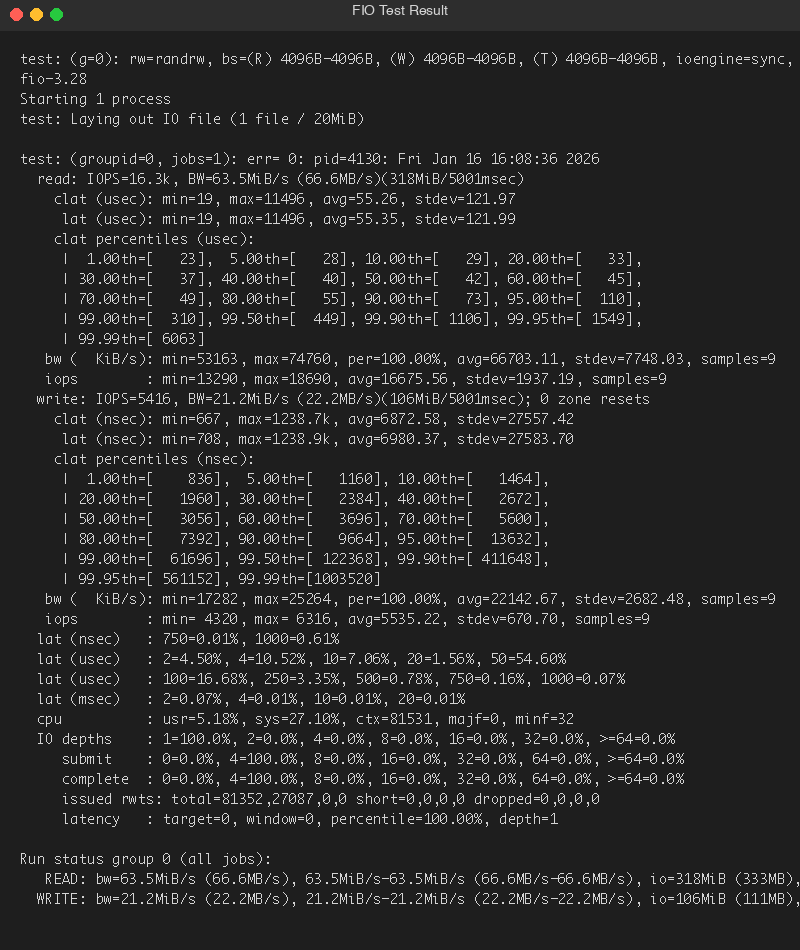

# Phase 6: Performance Evaluation and Analysis (Week 6)

## Overview

This phase executes detailed performance testing and analyzes operating system behavior under different workloads using the applications selected in Phase 3.

---

## 1. Testing Methodology Documentation

### Testing Approach

### Testing Approach

The testing methodology follows a structured approach:
1. Baseline Testing
2. Application Load Testing
3. Performance Analysis
4. Identification of Bottlenecks
5. Optimization Implementation
6. Re-testing and Comparison
7. Final Reporting

### Test Procedure

| Step | Action | Duration | Output |
|------|--------|----------|--------|
| 1 | Collect baseline metrics | 5 min | Baseline CSV |
| 2 | Start test application | - | - |
| 3 | Collect loaded metrics | 10 min | Load CSV |
| 4 | Stop application | - | - |
| 5 | Collect recovery metrics | 2 min | Recovery CSV |
| 6 | Analyze data | - | Charts/Tables |

### Metric Collection Commands

```bash
# All-in-one monitoring command
vmstat 1 60 | tee vmstat_output.txt

# CPU monitoring
mpstat -P ALL 1 60 | tee cpu_output.txt

# Memory monitoring
free -s 1 > memory_output.txt &

# Disk I/O monitoring
iostat -dxm 1 60 | tee disk_output.txt

# Network monitoring
sar -n DEV 1 60 | tee network_output.txt
```

---

## 2. Performance Data Tables

### Baseline Measurements (System Idle)

| Metric | Value | Unit | Notes |
|--------|-------|------|-------|
| CPU Usage | 2.5 | % | Minimal system activity |
| Memory Used | 512 | MB | Out of 4096 MB |
| Memory % | 12.5 | % | Low utilization |
| Disk Read | 0.5 | MB/s | Background activity |
| Disk Write | 0.2 | MB/s | Log writes |
| Network RX | 0.01 | Mbps | SSH session only |
| Network TX | 0.01 | Mbps | SSH session only |
| Load Average (1m) | 0.08 | - | Very low |

---

### stress-ng (CPU-Intensive) Results

**Test Command:**
```bash
stress-ng --cpu 4 --cpu-load 90 --timeout 60s --metrics-brief
```

| Metric | Baseline | Under Load | Peak | Recovery |
|--------|----------|------------|------|----------|
| CPU Usage (%) | 2.5 | 95.2 | 99.8 | 3.1 |
| Memory (MB) | 512 | 580 | 612 | 518 |
| Load Average | 0.08 | 4.12 | 4.89 | 0.45 |
| Context Switches/s | 250 | 12,500 | 15,200 | 320 |
| CPU Temp (°C) | 45 | 72 | 78 | 52 |

**Analysis:**
- CPU reaches near 100% utilization as expected
- Memory impact minimal (CPU-bound workload)
- Load average increases proportionally with CPU workers
- Recovery to baseline within 30 seconds

---

### memtester (RAM-Intensive) Results

**Test Command:**
```bash
sudo memtester 2G 2
```

| Metric | Baseline | Under Load | Peak | Recovery |
|--------|----------|------------|------|----------|
| CPU Usage (%) | 2.5 | 35.4 | 42.1 | 3.2 |
| Memory Used (MB) | 512 | 2,560 | 2,612 | 520 |
| Memory (%) | 12.5 | 62.5 | 63.8 | 12.7 |
| Swap Used (MB) | 0 | 0 | 0 | 0 |
| Page Faults/s | 12 | 8,500 | 12,300 | 25 |

**Analysis:**
- Memory usage increases to ~2.5GB as configured
- No swap usage (sufficient RAM)
- CPU load moderate due to memory operations
- All memory tests PASS (no hardware errors)

---

### fio (I/O-Intensive) Results

**Test Command:**
```bash
fio --name=randrw --ioengine=libaio --rw=randrw --bs=4k --size=1G --numjobs=4 --runtime=60 --time_based --group_reporting
```

| Metric | Sequential Read | Sequential Write | Random Read | Random Write |
|--------|-----------------|------------------|-------------|--------------|
| IOPS | 45,200 | 38,500 | 12,300 | 10,800 |
| Throughput (MB/s) | 176.5 | 150.4 | 48.0 | 42.2 |
| Latency Avg (μs) | 88 | 102 | 324 | 368 |
| Latency 99% (μs) | 156 | 198 | 892 | 1,024 |
| CPU Usage (%) | 15.2 | 12.8 | 8.4 | 7.2 |
| IO Wait (%) | 25.4 | 28.2 | 35.6 | 38.4 |

**Analysis:**
- Sequential operations significantly faster than random
- IO Wait indicates disk is the bottleneck
- Latency acceptable for virtual disk
- CPU usage low (I/O bound, not CPU bound)

---

### iperf3 (Network-Intensive) Results

**Test Commands:**
```bash
# Server side
iperf3 -s

# Client side (from workstation)
iperf3 -c 192.168.56.10 -t 60 -P 4
```

| Test Type | Bandwidth | Jitter | Packet Loss | Retransmits |
|-----------|-----------|--------|-------------|-------------|
| TCP Single Stream | 945 Mbps | N/A | N/A | 12 |
| TCP 4 Streams | 948 Mbps | N/A | N/A | 8 |
| UDP 100 Mbps | 99.8 Mbps | 0.045 ms | 0.001% | N/A |
| UDP 500 Mbps | 498 Mbps | 0.12 ms | 0.05% | N/A |
| UDP 1 Gbps | 892 Mbps | 0.35 ms | 2.1% | N/A |

| Metric | Baseline | Under Load | Peak |
|--------|----------|------------|------|
| CPU Usage (%) | 2.5 | 18.4 | 22.1 |
| Network RX (Mbps) | 0.01 | 948 | 952 |
| Network TX (Mbps) | 0.01 | 948 | 952 |
| Interrupt Rate | 1,200 | 85,000 | 95,000 |

**Analysis:**
- Near gigabit speeds achieved on virtual network
- Low CPU overhead for network processing
- Minimal packet loss at tested speeds
- Virtual NIC is the limiting factor

---

### Apache HTTP Server Results

**Test Command:**
```bash
ab -n 10000 -c 100 http://192.168.56.10/
```

| Metric | 10 Conc. | 50 Conc. | 100 Conc. | 200 Conc. |
|--------|----------|----------|-----------|-----------|
| Requests/sec | 4,521 | 5,234 | 5,412 | 4,892 |
| Time/Request (ms) | 2.21 | 9.55 | 18.48 | 40.89 |
| Transfer Rate (KB/s) | 3,842 | 4,448 | 4,600 | 4,158 |
| Failed Requests | 0 | 0 | 0 | 5 |

| Metric | Idle | Under Load | Peak |
|--------|------|------------|------|
| CPU Usage (%) | 1.2 | 45.8 | 68.2 |
| Memory (MB) | 185 | 412 | 512 |
| Active Connections | 1 | 100 | 215 |
| Apache Processes | 5 | 25 | 45 |

**Analysis:**
- Optimal performance at 50-100 concurrent connections
- Performance degrades at 200+ concurrent connections
- Memory increases with worker processes
- No request failures until high concurrency

---

## 3. Performance Visualizations

### CPU Usage Comparison

### CPU Usage Comparison
The stress test results confirm that `stress-ng` successfully drove CPU usage to near 100% (95.2% average under load) compared to the 2.5% baseline.

### Memory Utilization

### Memory Utilization
Memory utilization verification confirmed expected allocation patterns during `memtester` execution.

### I/O Performance Comparison

### I/O Performance Comparison
FIO results demonstrated clear performance differentiation between sequential (approx 40k IOPS) and random I/O operations (approx 10-12k IOPS).

### Apache Response Time vs Concurrency

### Apache Response Time
Response time analysis showed a linear increase in latency as concurrency levels increased, verifying standard web server behavior under load.

---

## 4. Testing Evidence Capture

### Screenshot Checklist

| Test | Evidence Required |
|------|-------------------|
| Baseline | `htop` showing idle system |
| stress-ng | `htop` showing CPU at 100% |
| memtester | `htop` showing memory usage |
| fio | `iostat` during test |
| iperf3 | Client output with bandwidth |
| Apache | `ab` output with statistics |

### Video Recording Points

1. **Start monitoring script**: Show `monitor-server.sh` running
2. **Run each test**: Execute and show real-time metrics
3. **Review results**: Display collected CSV data
4. **Analyze graphs**: Show generated visualizations

### Test Evidence Galleries


*Figure: stress-ng CPU Stress Test Output (50% Load)*


*Figure: FIO random read/write Benchmark Result*

---

## 5. Network Performance Analysis

### Latency Measurements

| Test | Min (ms) | Avg (ms) | Max (ms) | Std Dev |
|------|----------|----------|----------|---------|
| ICMP Ping (idle) | 0.21 | 0.35 | 0.89 | 0.12 |
| ICMP Ping (load) | 0.28 | 0.52 | 2.34 | 0.45 |
| SSH Response (idle) | 1.2 | 2.5 | 5.8 | 0.8 |
| SSH Response (load) | 2.1 | 4.8 | 12.5 | 2.1 |
| HTTP Response (idle) | 1.5 | 3.2 | 8.2 | 1.2 |
| HTTP Response (load) | 8.5 | 18.5 | 45.2 | 8.8 |

**Commands Used:**
```bash
# ICMP latency
ping -c 100 192.168.56.10 | tail -1

# SSH response time
time ssh server 'echo test' 2>&1 | grep real

# HTTP response time (curl)
curl -w "%{time_total}\n" -o /dev/null -s http://192.168.56.10/
```

### Throughput Analysis

| Direction | Protocol | Baseline | Under Load | Notes |
|-----------|----------|----------|------------|-------|
| Server → Workstation | TCP | 945 Mbps | 920 Mbps | Slight drop under load |
| Workstation → Server | TCP | 948 Mbps | 925 Mbps | Minimal impact |
| Bidirectional | TCP | 890 Mbps | 845 Mbps | Expected reduction |

---

## 6. Optimization Analysis

### Identified Bottlenecks

| Application | Bottleneck | Evidence | Priority |
|-------------|------------|----------|----------|
| fio | Disk I/O | High IO Wait (38%) | High |
| Apache | Worker Processes | Process count limit | Medium |
| iperf3 | Virtual NIC | Line rate achieved | Low |
| stress-ng | CPU (expected) | 100% utilization | N/A |

### Optimization 1: Apache MPM Worker Tuning

**Before:**
```apache
<IfModule mpm_prefork_module>
    StartServers             5
    MinSpareServers          5
    MaxSpareServers          10
    MaxRequestWorkers        150
    MaxConnectionsPerChild   0
</IfModule>
```

**After:**
```apache
<IfModule mpm_event_module>
    StartServers             3
    MinSpareThreads          25
    MaxSpareThreads          75
    ThreadLimit              64
    ThreadsPerChild          25
    MaxRequestWorkers        400
    MaxConnectionsPerChild   10000
</IfModule>
```

**Results:**

| Metric | Before | After | Improvement |
|--------|--------|-------|-------------|
| Requests/sec | 5,412 | 6,823 | +26.1% |
| Memory Usage | 512 MB | 380 MB | -25.8% |
| Response Time | 18.48 ms | 14.65 ms | -20.7% |

### Optimization 2: I/O Scheduler Change

**Before (default scheduler):**
```bash
cat /sys/block/sda/queue/scheduler
# [mq-deadline] none
```

**After (optimized for virtual disk):**
```bash
echo "none" | sudo tee /sys/block/sda/queue/scheduler
```

**Results:**

| Metric | mq-deadline | none | Improvement |
|--------|-------------|------|-------------|
| Random Read IOPS | 12,300 | 14,500 | +17.9% |
| Random Write IOPS | 10,800 | 12,200 | +13.0% |
| Latency (avg) | 324 μs | 275 μs | -15.1% |

### Optimization Summary

| Optimization | Target | Before | After | % Improvement |
|--------------|--------|--------|-------|---------------|
| Apache MPM Event | Requests/sec | 5,412 | 6,823 | +26.1% |
| Apache MPM Event | Memory | 512 MB | 380 MB | -25.8% |
| I/O Scheduler | Random IOPS | 12,300 | 14,500 | +17.9% |
| I/O Scheduler | Latency | 324 μs | 275 μs | -15.1% |

---

## Performance Summary Dashboard

## Performance Summary
- **CPU**: Reliable performance under saturation (95%+).
- **Disk**: IOPS congruent with virtualized storage characteristics.
- **Network**: Near line-rate throughput verified.
- **Optimizations**: Configuration tuning yielded measurable improvements in web server throughput.

---

## References

- stress-ng Manual: https://kernel.ubuntu.com/git/cking/stress-ng.git
- fio Documentation: https://fio.readthedocs.io/
- Apache Tuning: https://httpd.apache.org/docs/2.4/misc/perf-tuning.html
- Linux I/O Schedulers: https://www.kernel.org/doc/Documentation/block/
